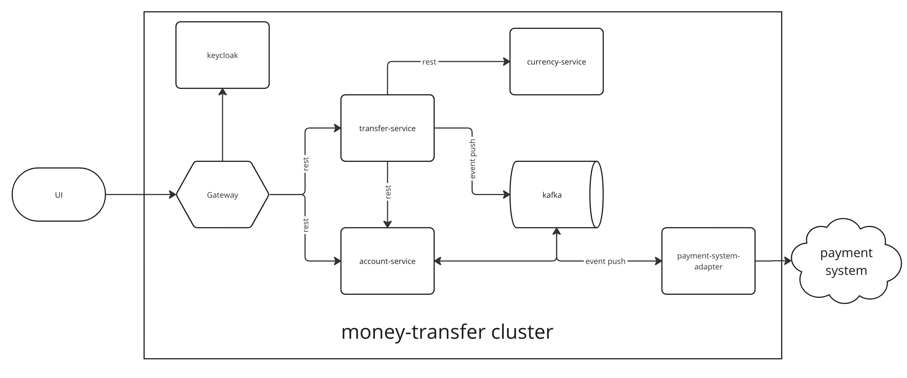

# Money transfer

Demo project for money-transfer application

## Using technologies
- Java
- Spring Boot
- WebFlux
- R2DBC
- Kafka
- Spring Cloud Streams
- Postgres
- MongoDb
- KeyCloak

## Architecture

## Cluster
- [gateway](mt-gateway) 
- [transaction-service](transaction-service) - handle transaction information and logic
- [account-service](account-service) - handle accounts
- [currency-service](currency-service) - service for get currency information
- [payment-system-adapter](payment-system-adapter) - adapter for foreign payment system
- [common](common) - common library
- [mt-starter](money-transfer-starter) - common starter

## Links
[repository](https://github.com/1000001rtem/money-transfer)

## Contacts
Author: Eremin Artem

Site: [1000001rtem.com](http://1000001rtem.com)

Email: 1000001rtem@gmail.com